# Q4 Sombrero Blanco CTF 2020 Write-up

## Preámbulo
¡Hola a todos! Les escribe 0xcafecafe. En esta ocasión veremos una forma de resolver los retos de Q4 Sombrero Blanco CTF 2020.

Intentaré ser lo más sencillo y directo posible en el write-up.

## Sinopsis del CTF
+ **Fecha de inicio**: 24-jul-2020
+ **Duración**: 24 horas
+ **URL**: https://q4sbctf.duckdns.org:9999
+ **Evento relacionado**: 2da. conferencia de Sombreros Blancos "Cibercrisis"

## Retos explicados

+ Entry:
  + [Roma](#roma)
  + [uwu](#uwu)
+ Misc:
  + [Señal de auxilio](#senal-de-auxilio)
  + [Viaje místico](#viaje-mistico)
+ Esteganografía:
  + [Hidden](#hidden)
  + [Violín triste](#violin-triste)
  + [Originale](#originale)
  + [Sartaarap](#sartaarap)
+ Criptografía:
  + [Jueguemos](#jueguemos)
  + [330](#r330)
  + [El espejo](#el-espejo)
  + [Terrible de Shoro](#shoro)
  + [Ancient](#ancient)
+ Web:
  + [tnoF](#tnof)
  + [Mapiemos](#mapiemos)
  + [Enum](#enum)
  + [Común](#comun)
  + [Quién???](#quien)
  + [Insistencia!!!](#insistencia)

## Resolución

### Entry: Roma {#roma}
> Ya debieras poder identificarlo, es uno de los más utilizados y simples..
>
> La bandera debe ir en el formato Q4SB{aqui_va_la_bandera}
>
> Rfgn uvfgbevn rf znf ivrwn dhr ry uvyb arteb. Rfgn uvfgbevn cebivrar qr yn rcbpn qry Rzcrenqbe Prfne Nhthfgb. Qror fre hab qr ybf pevsnqbf znf nagvthbf qry zhaqb. Ybf npragbf ab chrqra fre hfnqbf ndhv gnzcbpb ybf fvtabf. Yn onaqren rf NyPrfneYbDhrRfqryPrfne
>
> by n3v1l

El título del reto (Roma) nos induce a pensar en el cifrado de César, pero si lo pruebas con el texto cifrado que dan, no obtienes nada.

Igual, parece que se trata de algún cifrado al estilo César; o sea, de rotación de caracteres. Usando la herramienta [CyberChef](https://gchq.github.io/CyberChef/) y probando con el clásico [ROT13](https://es.wikipedia.org/wiki/ROT13) se obtiene:

`Esta historia es mas vieja que el hilo negro. Esta historia proviene de la epoca del Emperador Cesar Augusto. Debe ser uno de los crifados mas antiguos del mundo. Los acentos no pueden ser usados aqui tampoco los signos. La bandera es AlCesarLoQueEsdelCesar`

**flag: Q4SB\{AlCesarLoQueEsdelCesar\}**

---
### Entry: uwu {#uwu}
> ♥w♥
>
> by dplastico

Al hacer un `file` sobre el archivo del reto (uwu), vemos que es un ejecutable Linux de 64 bits. Lo primero que hago, en estos casos, es usar la herramienta `strings` para ver qué cadenas ASCII tiene el binario.

Ejecutando `strings` sobre `uwu`, obtenemos la flag directamente:

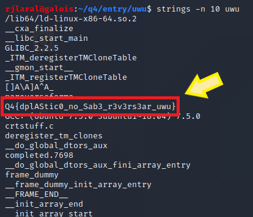

**flag: Q4\{dplAStic0_no_Sab3_r3v3rs3ar_uwu\}**

---
### Misc: Señal de auxilio {#senal-de-auxilio}
> Se ha detectado una señal de auxilio en alta mar... podrás ayudar? Acuérdate que la bandera está en el formato Q4SB{Aqui_va_la_bandera}
>
> by n3v1l

Nos entregan un archivo WAV con el reto. Suelo comenzar usando las herramientas `exiftool`, `strings` y `Sonic Visualiser` cuando se trata de un archivo de audio; pero no obtuve nada.

El título del reto (señal de auxilio) me orienta a clave Morse o algo similar. Usando la herramienta en línea [Morse Decoder](https://morsecode.world/international/decoder/audio-decoder-adaptive.html) y cargando el archivo WAV, ofrece la siguiente salida:

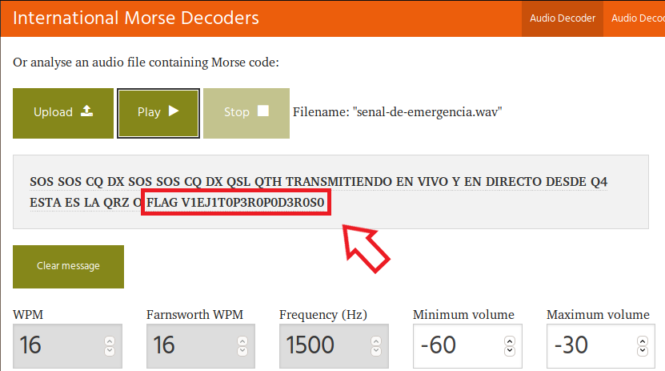

**flag: Q4SB\{V1EJ1T0P3R0P0D3R0S0\}**

---
### Misc: Viaje místico {#viaje-mistico}
> Este es un viaje mistico realizado con hongos.. podrás soportarlo? La Bandera está en formato Q4SB{aqui_va_la_flag}
>
> by n3v1l

Nos dan un archivo de texto que contiene puras palabras alusivas a Pikachu, uno de los personajes de Pokemon. Esto pareciese un [lenguaje de programación esotérico](https://es.wikipedia.org/wiki/Lenguaje_de_programaci%C3%B3n_esot%C3%A9rico) (Una buena referencia a lenguajes de programación esotéricos se encuentra en [Esolangs](https://esolangs.org/wiki/Main_Page)) Buscando en Esolangs, confirmamos que, efectivamente, pertenece al lenguaje de programación esotérico [Pikalang](https://esolangs.org/wiki/Pikalang).

En Python, existe un módulo llamado [pikalang](https://github.com/groteworld/pikalang) que se puede instalar bien sea desde su repositorio de Github o haciendo uso de PIP (`pip install pikalang`)

Ejecutando `pikalang` sobre el archivo de texto (es necesario renombrar la extensión del archivo y ponerlo como .pokeball) se obtiene:

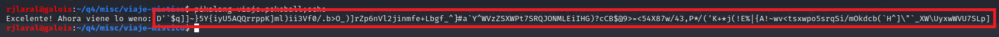

El texto obtenido parece otro lenguaje de programación esotérico. Siguiendo el *hint* del reto (viaje místico), se puede sospechar que este último texto está en lenguaje [Malbolge](https://esolangs.org/wiki/Malbolge). Este nombre hace alusión a ['Malebolge'](https://es.wikipedia.org/wiki/Malebolge), el octavo círculo del Infierno, según la obra 'La Divina Comedia' de Dante Alighieri. De allí, la referencia a "viaje místico".

Usando un [interpretador de Malbolge online](http://malbolge.doleczek.pl/), se obtiene:

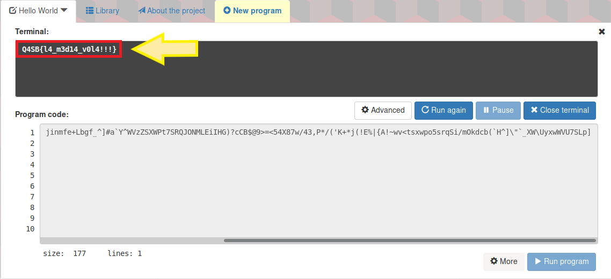

**flag: Q4SB\{l4_m3d14_v0l4!!!\}**

---
### Esteganografía: Hidden {#hidden}
> Está todo oscuro, no ves nada... encontrarás lo oculto?
>
> La Bandera está en formato Q4SB{aqui_va_la_flag}
>
> by n3v1l

Ya con el propio texto del reto, nos da idea de que está presente en la propia imagen del reto; pero oculto de alguna forma.

Antes que nada, usé las herramientas `file`, `exiftool` y `strings`; pero no obtuve nada.

Usando la herramienta `stegsolve`, se puede apreciar en el Red plane 1, Green plane 1, Blue plane 1 y Random colour map un texto, pero se ve muy pequeño. 

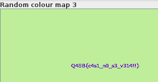

Usando la forense de imágenes en línea [Forensically](https://29a.ch/photo-forensics/)(para mí, de las mejores), con la opción 'Luminance Gradient' y pasando el cursor sobre lo que parece una 'mancha', se puede apreciar claramente:

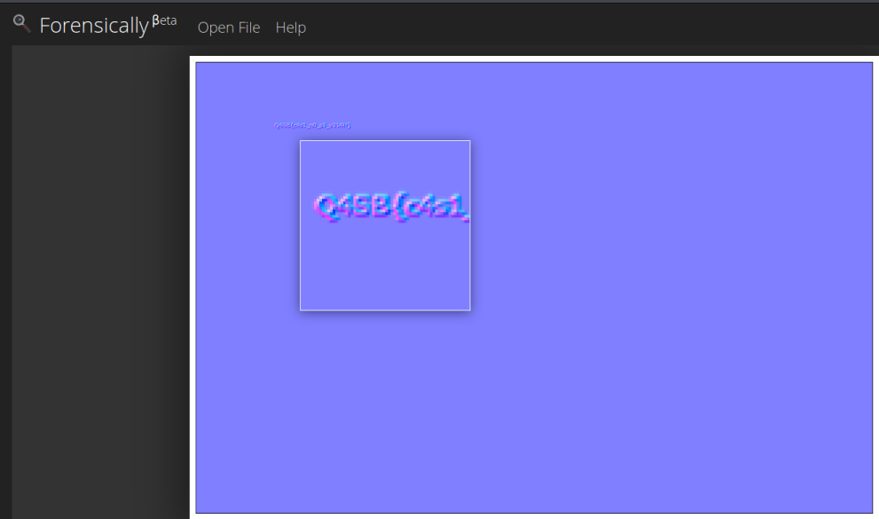

**flag: Q4SB\{c4s1_n0_s3_v314!!\}**

---
### Esteganografía: Violín triste {#violin-triste}
> El violin triste algo oculta... escuchalo, perdón, encuéntralo!
>
> by n3v1l

Ejecutando `file` sobre el archivo del reto, vemos que es un archivo WAV en un contenedor RIFF. Aplicando `strings` sobre ese archivo, obtenemos una cadena en base64 que al decodificarla obtenemos:

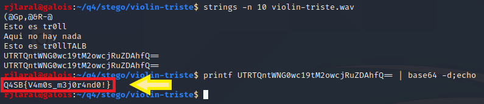

**flag: Q4SB\{V4m0s_m3j0r4nd0!\}**

---
### Esteganografía: Originale {#originale}
> Cuánto sabes de italiano? 
>
> La bandera está en el formato Q4SB{aqui_va_la_flag} 
>
> by n3v1l

En este reto, no hay que usar herramientas. Al abrir el archivo de texto que nos ofrece el reto, podemos observar que se trata de un [acróstico](https://es.wikipedia.org/wiki/Acr%C3%B3stico) y el texto obtenido es: "NoMiresaqUilaflagesc4s1nolap1ll0"

**flag: Q4SB\{c4s1nolap1ll0\}**

---
### Esteganografía: Sartaarap {#sartaarap}
> Vaporweando un rato
>
> by dplastico

Este es de los retos más largos. Ejecutando `file` sobre el archivo del reto, se comprueba que es un JPG. Usando `strings` no se obtiene nada. 

Usando `binwalk` se observa que hay un archivo ZIP dentro de la imagen. Se usa `binwalk -e ` para extraer el ZIP. `binwalk` intenta decomprimir el ZIP, pero éste está cifrado, por lo que los archivos extraídos del ZIP tienen 0 bytes de longitud.

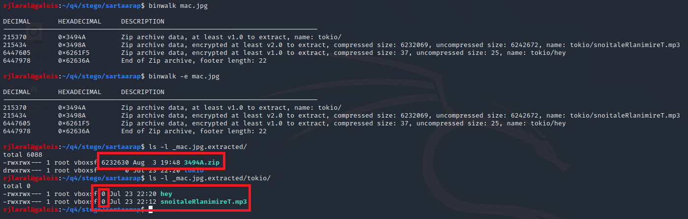

Usamos la herramienta `fcrackzip` con el archivo 'rockyou.txt' para descifrar el ZIP. Antes, copiamos el ZIP y lo renombramos como 'tokio.zip'. Importante!: usar `fcrackzip` con la opción '-u', de lo contrario, no funciona como se espera:

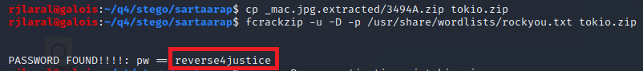

Se usa el *password* encontrado en el paso anterior para decomprimir el ZIP con `unzip`, usando la opción '-j' para que decomprima los archivos en la carpeta actual. Se obtiene un archivo de texto que contiene "vaporwaveandolaenyoutube" y un archivo de audio MP3:

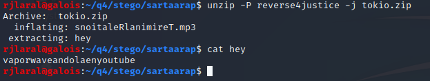

Al escuchar el MP3, pareciese que estuviese al revés, como lo indica el título del reto. Hay que buscar una forma de reversar el audio. Usando la herramienta online [3pm](https://www.mp3-reverser.com/en/), se descarga otro archivo MP3 con el audio reversado. Al escuchar este nuevo archivo, se obtiene la flag.

**flag: Q4SB\{dificilescantarlaflag\}**

---
### Criptografía: Jueguemos {#jueguemos}
> Estás seguro que puedes identificar las distintas codificaciones? 
>
> Jueguemos.. 
>
> Acuerdate de ingresar la bandera en el formato: Q4SB{aqui_viene_la_flag}
>
> IBLEWQ3LFNLXIMZUIVRDALJBIJVTWMDNIROWS2ZJIYQSYIRNIYVCSLBWIZBUENJVIBZEO3LMIFXGEYLAIBYWM2ZBIFKEWSJSIA6CIRRIFNCCGVRZL5VUCMTQIZLWEWCEIFJWYLRCGNNHCOKWHNQVAZ3GINUEORZPGFHFEWDQIQUHAJB4GFUVESLLIREWESKYIREWER2M
>
> by n3v1l

Este reto es un poco engañoso, porque no es criptografía como tal, sino de codificación. En general, en los retos de codificación, se trata de ir 'adivinando', tomando indicios del propio texto. 

Al ver el mensaje del reto, se observa que todas las letras están en mayúsculas. Al ser así, se sospecha directamente de 'base32'. Usando `CyberChef` para decodificar, se obtiene:

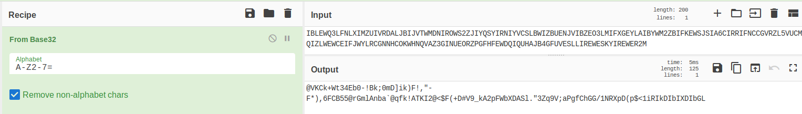

Por las características del texto resultante, parece base85. Usando otra vez `CyberChef` para decodificar, se obtiene:

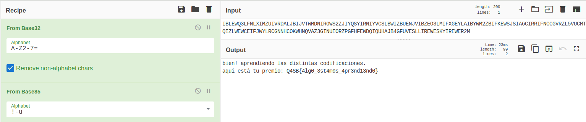

**flag: Q4SB\{4lg0_3st4m0s_4pr3nd13nd0\}**

---
### Criptografía: 330 {#r330}
> MNEFM3C2I5LHUSKHKJWGGMSOOBNG4STIMNUUE42ZKNBG2YSHIZXFA6KCOVRHSQTMMJXFE4C2K42W WYTZIJ2FUU2CONMVGQTULFLTK23CPFBHIYKTIJUFS3SWNQFGER2FONEUONLWJFDVM5LEI5WGYYTN KJ3EYQ2CNZNFONLMMNWUM43CK5LHKZCHKVTVUWCONJRW23DJLJJUEMDCGJJHMSKHKZ2USRZRNBSV QVT2LEZVM42ZLBGWQCSJIZCTAVJQJI3U42SZGFHEISLXJVCESMCNNJTXOTKEM4YE26SBO5HVIWJT JZ5GQOKDM46T2CQ=

No hay texto en este reto. Por las características del código dado, parece base32. Usaremos `CyberChef` para decodificar:

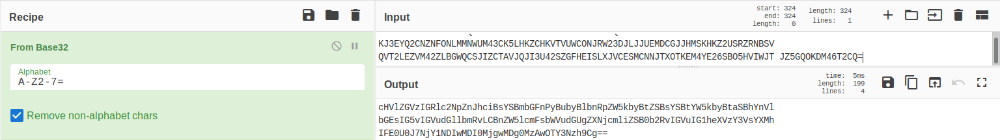

El texto obtenido parece base64. Usando `CyberChef` para decodificar, se obtiene:

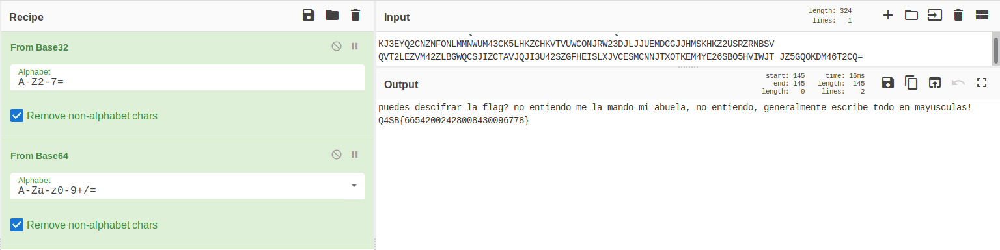

Aquí hay varias 'pistas': 1) La flag son puros números y no parece ASCII ni hexadecimal; 2) Lo manda la abuela, queriendo decir que está relacionado con algo que se usaba antiguamente; y 3) Escribe todo en mayúsculas, lo que quiere decir que cuando consigamos el texto, lo coloquemos todo en mayúsculas.

Yo tengo ya mi edad y al ver esos números, me imaginé dos cosas: 1) O es Multi-tap Phone (como se escribían los mensajes SMS en los primeros teléfonos móviles); o 2) Es T9 Predictor (una mejora del primero, para escribir palabras tecleando menos)

Aquí, usé las herramientas ofrecidas por [Dcode](https://www.dcode.fr/en/) (otra que considero una excelente herramienta), tanto para Multi-tap Phone como para T9 y resultó ser este último. La salida es la siguiente:

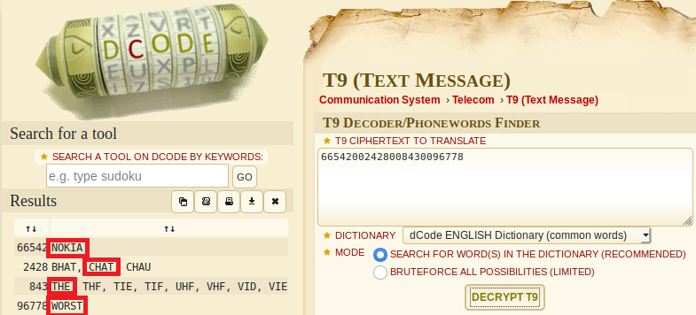

Escogiendo las salidas ofrecidas, se obtiene la flag.

**flag: Q4SB\{NOKIACHATTHEWORST\}**

---
### Criptografía: El espejo {#el-espejo}
> Las apariencias pueden ser engañosas... lograrás descifrarlo? Es simple, quizás... La bandera debe ir en el formato Q4SB{aqui_va_la_bandera}
>
> HV EVRZ NZH HRNKOV VHGV XRUIZWLI KLI OL GZMGL GV TZMZHGV OZ UOZT JFV WVYV RI ZWVMGIL VHGVXRUIZWLIVHSVYIVL
>
> by n3v1l

El título es la pista para resolver el reto. Buscando en `Dcode`, nos encontramos con el cifrado 'Atbash Mirror'.

Aplicando ese cifrado al texto del reto, se obtiene:

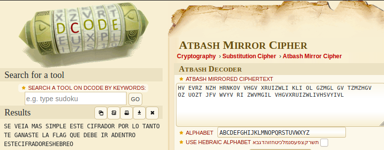

**flag: Q4SB\{ESTECIFRADORESHEBREO\}**

---
### Criptografía: TERRIBLE DE SHORO {#shoro}
> SIEMPRE GRITANDO EL TERRIBLE DE SHORO PERO NO SE LE ENTIENDE, PUEDES DESENCRIPTARLO? Acuérdate que la bandera se sube en el formato Q4SB{BANDERA_AQUI}
>
> ====== MENSAJE ENCRIPTADO DEL SHORO AHORA=====
>
> 5Q%QR25QR2-U#U/%R3U8Q2U#PU%R9Q3
>
> =======FIN DEL MENSAJE =========
>
> by n3v1l

Aquí obtuve ayuda del propio n3v1l, a quien envío un saludo. Me comenta que en Chile, es muy común que las palabras que usan "X" las pronuncien y escriban con "SH".

Así que, el título, vuelve a ser una pista para el problema. Si cambiamos a la palabra "SHORO" por "XORO", nos indica que debemos usar "XOR" para resolver el problema.

Volviendo a usar la herramienta `CyberChef` con la opción 'XOR Brute Force', se obtiene la clave 'Key = 61' y la flag:

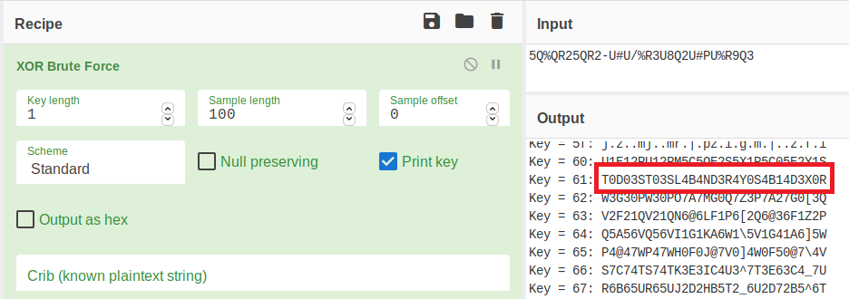

**flag: Q4SB\{T0D03ST03SL4B4ND3R4Y0S4B14D3X0R\}**

---
### Criptografía: Ancient {#ancient}
> Se encontró esta piedra en algún lugar del mundo... claramente tiene un mensaje... puedes descifrarlo?
>
> Acuérdate que la bandera está en el formato Q4SB{Aqui_va_la_bandera}
>
> P.D. La imagen de la roca es referencial, sólo importa el mensaje LOL
>
> by n3v1l

El texto en la roca es "BAHA HIBO BAHI BOHE BIKI BOKO HIBO BOHI BOKI BADI BABO BOKO HIHI BADI BAHO BODO HIBO BODE HIHI BABO BIDA".

Usando la herramienta `Dcode`, buscando cifradores que tengan estas características, encontramos el cifrador 'Bibi-binary Code'. Usando este último en el mensaje:

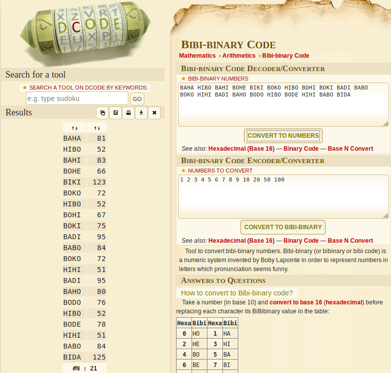

Cada número es la representación decimal de un caracter siguiendo la tabla ASCII. Usando Python para hacer la conversión, se obtiene:

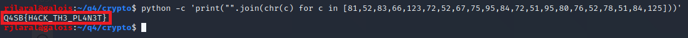

**flag: Q4SB\{H4CK_TH3_PL4N3T\}**

---
### Web: tnoF {#tnof}
> A disfrutar este cumbion !!!!
>
> http://q4sbctf.duckdns.org:8080/

La flag está en el código fuente de la página web:

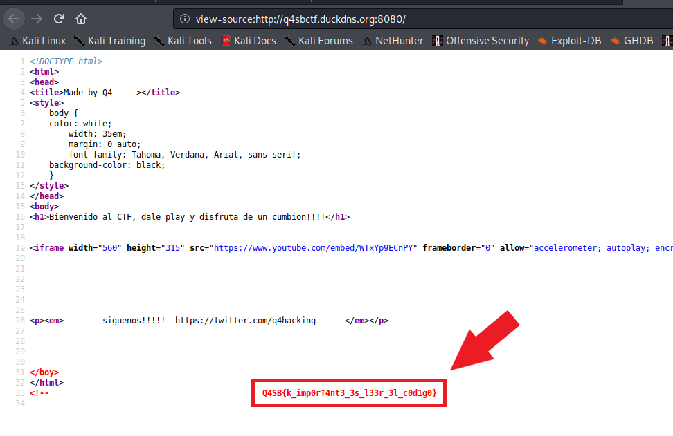

**flag: Q4SB\{k_imp0rT4nt3_3s_l33r_3l_c0d1g0\}**

---
### Web: Mapiemos {#mapiemos}
> No te voy a dar un pista....jojojojo
>
> http://q4sbctf.duckdns.org:8080/

Revisar el archivo 'robots.txt'. El primer base64 es la flag:

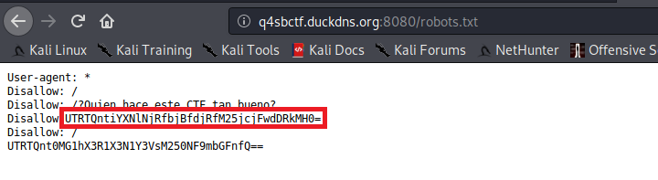

**flag: Q4SB\{base64_n0_v4_3ncr1pt4d0\}**

---
### Web: Enum {#enum}
> Qué importante es la enumeración
>
> http://q4sbctf.duckdns.org:8080/

Es el otro base64 dentro de 'robots.txt':

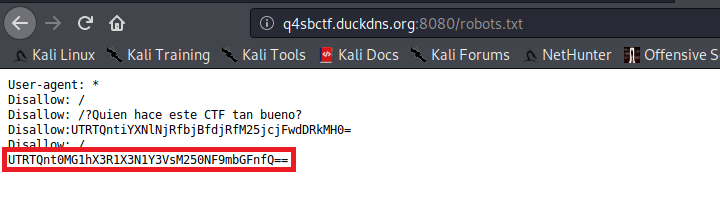

**flag: Q4SB\{t0ma_tu_sucul3nt4_flag\}**

---
### Web: Común {#comun}
> comun .... :) 
>
> http://q4sbctf.duckdns.org:8080/

Usando la herramienta `gobuster` y el diccionario '/usr/share/seclists/Discovery/Web-Content/big.txt' se enumera la ruta '/api':

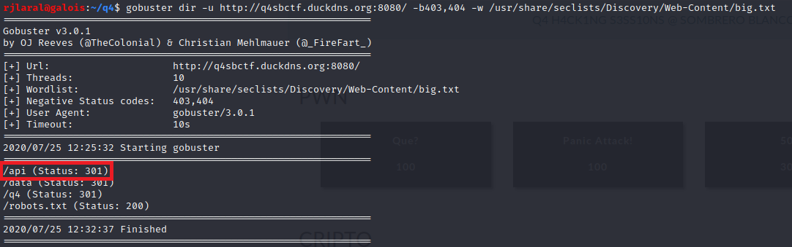

Haciendo la consulta vía 'GET', se obtiene la flag:

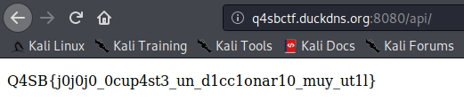

**flag: Q4SB\{j0j0j0_0cup4st3_un_d1cc1onar10_muy_ut1l\}**

---
### Web: Quien??? {#quien}
> En la enumeracion anterior vas a encontrar cosas muy utiles.
>
> http://q4sbctf.duckdns.org:8080/

En la enumeración anterior, se encontró además la ruta '/q4':

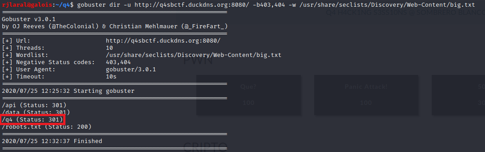

Haciendo la consulta vía 'GET', se obtiene la flag:

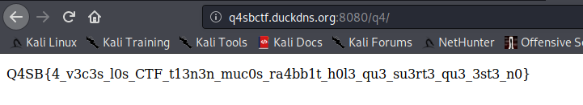

**flag: Q4SB\{4_v3c3s_l0s_CTF_t13n3n_muc0s_ra4bb1t_h0l3_qu3_su3rt3_qu3_3st3_n0\}**

---
### Web: Insistencia!! {#insistencia}
> Si ya encontraste algo, se perseverante
>
> http://q4sbctf.duckdns.org:8080/

En la enumeración anterior, se encontró la ruta '/data' la cual da un error al tratar de accederla. 

Si se hace una enumeración sobre '/data', se obtiene una subruta '/data':

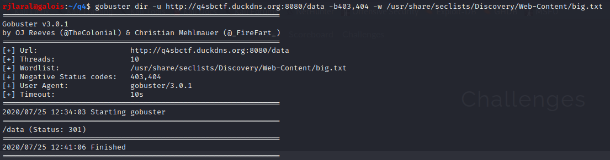

Haciendo la consulta vía 'GET', se obtiene la flag:

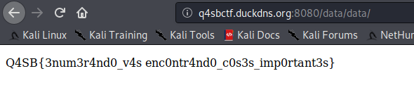

**flag: Q4SB\{3num3r4nd0_v4s enc0ntr4nd0_c0s3s_imp0rtant3s\}**